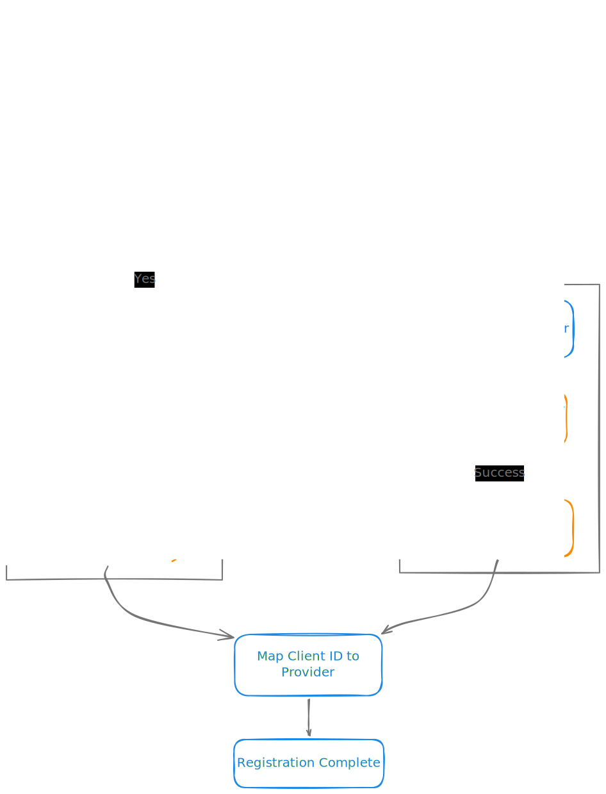
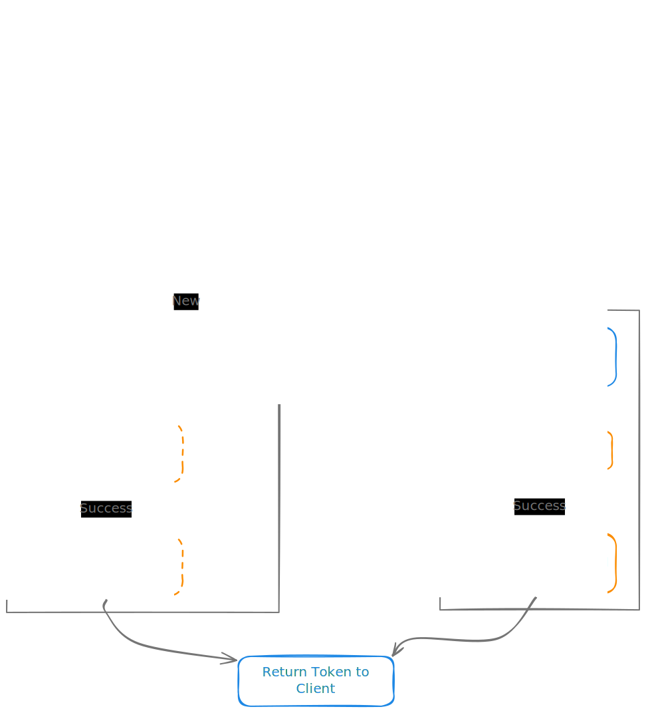
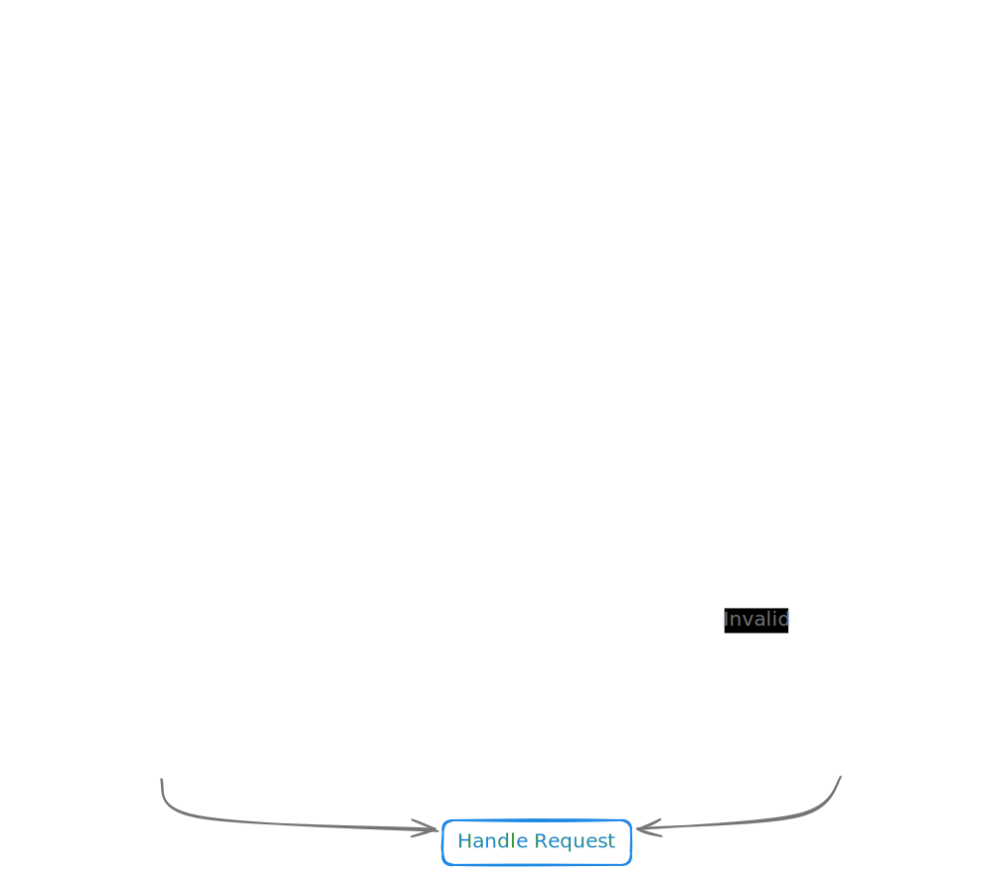

## Introduction

Recently, I completed a successful migration plan to a new OAuth provider in production. The provider was used to authorize incoming requests sent by external clients to a critical service with a high SLA. The criticality of the service implied that the migration had to be done with zero downtime to meet that SLA. Thus, I needed to prepare and implement a strategy for switching over from one OAuth provider to another without service disruption.

In the following post, I will walk you through the challenges of the migration and the decisions I made to overcome them.

## The Service

Before diving into the migration, let me briefly describe the service itself and how it authorizes incoming requests. The service provides an API that clients integrate with their backends. These backends then make requests to the API on their own behalf. Since no human user is involved, such communication is referred to as Machine-to-Machine (M2M).

Only authorized backends can call the service; therefore an authorization mechanism is required. To implement this, the service uses the OAuth [client credentials grant flow](https://datatracker.ietf.org/doc/html/rfc6749#section-4.4), which is well-suited for M2M communication. To put it simply, a client’s backend requests an access token from an authorization server and uses it to request the service. The service, in turn, verifies the access token and handles the request if the token is valid.

The OAuth provider’s role here is to host the authorization server and issue client credentials. These credentials are generated once a client registers their backend with the provider.

Clients, however, do not access the provider directly. Instead, they register their backends on a special web portal backed by the service. Nor do they request access tokens from the provider’s authorization server; rather, clients call a special proxy service that then calls the actual authorization server.

## The Challenges

Now that you understand the service’s architecture and authorization flow, let me point out the challenges that I had to overcome.

In the OAuth client credentials grant flow, credentials are static and valid for a long period. This implies that after a client registers their backend with the provider, the generated credentials are hardcoded in the backend configurations and remain intact until they expire. If a simple cutover without thorough planning had been done, every client using the service would have had to register their backends with the new provider and update the configurations accordingly. Moreover, such a disruptive change would have inevitably led to downtime.

## The Solution: A Three-Phase Approach

Considering the challenges and objectives, I prepared a migration strategy consisting of three distinct phases. The first phase aimed to integrate the new OAuth provider into the service. During the second phase, the new provider was activated while keeping the integration with the legacy provider functional. In the final, the legacy provider was deactivated and decommissioned.

### Phase One: Integration

To integrate the new provider into the service, three distinct system components had to be modified: the web portal (where clients register their backends), the proxy service (which stands between a client’s backend and the provider’s authorization server), and the service’s authorization logic.

Modifications to the web portal were straightforward. The portal originally called the legacy provider’s API when a client registered their backend. Consequently, it was possible to implement a compatible adapter for the new provider’s API along with a feature flag that controlled which API was in use. 

It is important to note that credentials issued before switching to the new provider had to remain valid so clients could continue using the service without disruption. To make this possible, the other two system components had to support both providers simultaneously.

Clients used the proxy service to exchange their credentials for an access token. Upon receiving a request, the proxy performed additional checks and then called the legacy provider’s authorization server. Therefore, a similar approach to the one described above could be employed.
Integration with the new provider was added to the proxy service so it could call the authorization server hosted by either provider. When a client sent a request to exchange credentials for an access token, the Client ID was used to determine which provider the client belonged to.

The service’s authorization logic was modified to support access tokens issued by the legacy and new providers simultaneously. Depending on the value of the token’s *iss* (issuer) [claim](https://datatracker.ietf.org/doc/html/rfc7519#section-4.1.1), the service utilized the appropriate SDK to verify the token.

### Phase Two: Rolling Out

After all the necessary development was complete, the system components were gradually deployed to the upper environments. Upon confirming readiness, the feature flag was enabled, and new client backends began registering with the new provider. Simultaneously, existing clients could continue using credentials issued by the legacy provider until they expired.

### Phase Three: Cleanup

The dual-provider solution remained in operation until the final legacy credentials expired. After confirming that no clients were using them, it was safe to remove the legacy provider integration from the three aforementioned system components. This step marked the completion of the migration.
